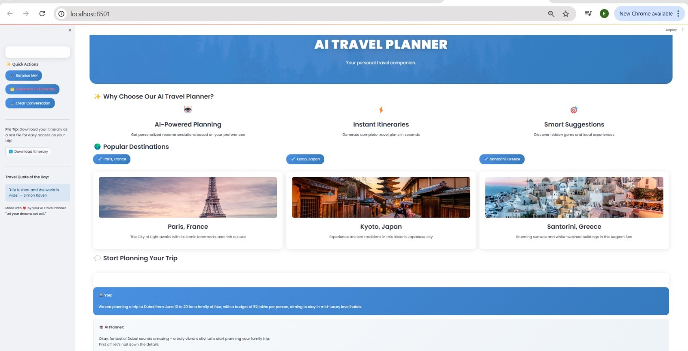
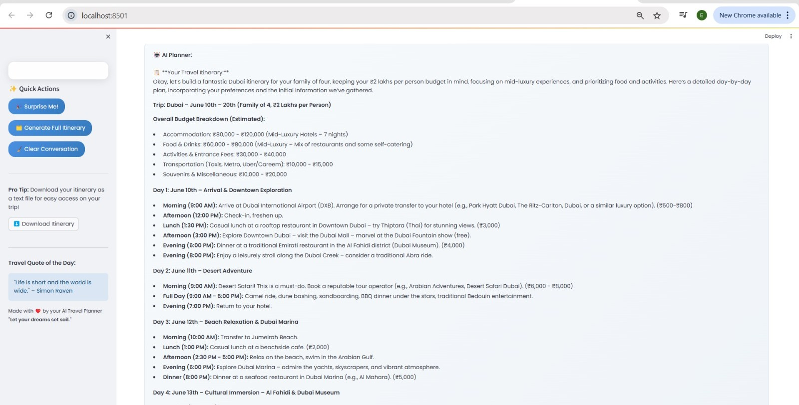

# AI Travel Planner

An intelligent travel planning assistant that helps users create personalized travel itineraries.

## Features

- 🤖 AI-powered travel planning
- 💬 Natural conversation interface
- 📅 Personalized itinerary generation
- 💰 Budget-aware suggestions
- 🌍 Local insights and recommendations

## 🚀 App Screenshots

Here's a preview of the AI Travel Planner in action:

### 🌐 Landing Page


### 🗺️ Example Itinerary


## Setup

1. Clone the repository:
```bash
git clone https://github.com/Nikita-NA/ai-travel-planner.git
cd ai-travel-planner
```

2. Install dependencies:
```bash
pip install -r requirements.txt
```

3. Run the application:
```bash
streamlit run app.py
```


## Usage

1. Start the application using `streamlit run app.py`
2. Open your web browser to the provided URL (usually http://localhost:8501)
3. Tell the AI about your travel plans:
   - Destination
   - Travel dates
   - Budget
   - Preferences
4. Chat with the AI to refine your plans
5. Generate a full itinerary when ready

## Tips for Best Results

- Be specific about your preferences
- Mention your budget range
- Include any special requirements
- Ask about local customs and tips

